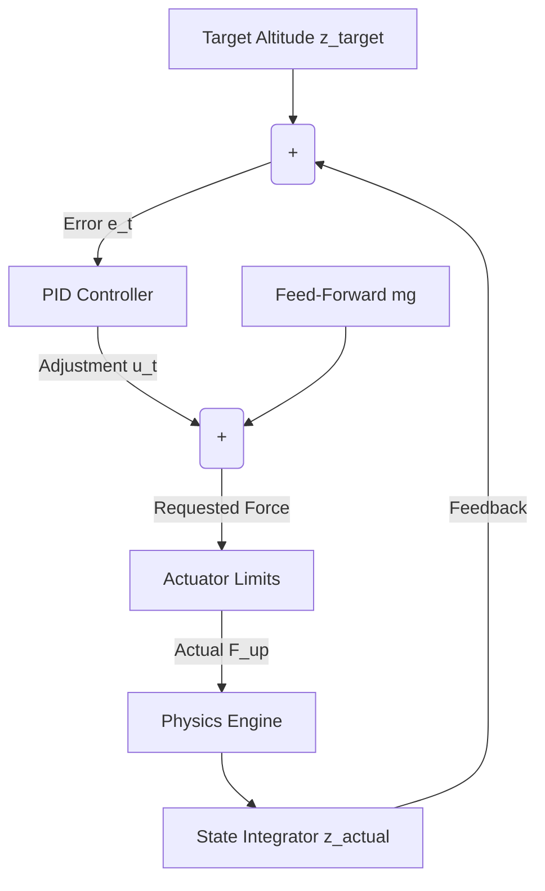

# Control System for Gravity Compensation

This document outlines the design and theoretical foundations of the control system used to maintain altitude (hover) or execute controlled ascents via gravity compensation.

## 1. Force Balance Condition

To maintain a perfectly stable altitude (hover), the net vertical acceleration must be zero ($a_z = 0$) and vertical velocity must be zero ($v_z = 0$). By Newton's second law, the sum of forces in the vertical axis must balance:

$$ \sum F_z = F_{up} - mg - F_{drag} = 0 $$

Since velocity is zero during a perfect hover, the aerodynamic drag $F_{drag}$ is zero. Therefore, the baseline force required for gravity compensation is simply:

$$ F_{up, baseline} = mg $$

## 2. Error Definition

The control system operates by continuously measuring the discrepancy between the desired target altitude and the current actual altitude. 

$$ e(t) = z_{target}(t) - z_{actual}(t) $$

Where:
*   $e(t)$: Altitude error (meters)
*   $z_{target}(t)$: The desired altitude setpoint
*   $z_{actual}(t)$: The current altitude from the physics integrator

## 3. PID Control Formulation

To dynamically correct the altitude error, we use a Proportional-Integral-Derivative (PID) controller. The raw control signal $u(t)$ is calculated as:

$$ u(t) = K_p e(t) + K_i \int_{0}^{t} e(\tau) d\tau + K_d \frac{de(t)}{dt} $$

Where:
*   **$K_p$ (Proportional Gain):** Reacts to the current error. Provides the primary driving force but can cause oscillation if too high.
*   **$K_i$ (Integral Gain):** Accumulates past errors to eliminate steady-state offset (e.g., if the mass is slightly heavier than expected).
*   **$K_d$ (Derivative Gain):** Predicts future error by analyzing the rate of change. Provides damping to prevent overshoot.

## 4. Control Output Mapping to Force/Thrust

The raw control signal $u(t)$ must be mapped to a physical force applied to the aerospace body. To minimize the effort required by the PID loop, we use **feed-forward gravity compensation**. 

The total upward force applied by the actuators (e.g., thrust or magnetic levitation) is the sum of the baseline gravity compensation and the dynamic PID output:

$$ F_{up}(t) = mg + u(t) $$

**Actuator Saturation:** Physical systems cannot produce infinite force. The output must be clamped between $F_{min}$ (often 0, since thrust rarely pulls downward) and $F_{max}$ (maximum actuator capacity):

$$ F_{up, clamped} = \max(0, \min(F_{max}, F_{up}(t))) $$

## 5. Stability, Overshoot, and Damping Considerations

### Stability Conditions
For the closed-loop system to be stable, the poles of the transfer function must lie in the left-hand plane. Practically, this means:
1. $K_p$, $K_i$, and $K_d$ must be strictly positive ($>0$).
2. The derivative gain $K_d$ must be large enough to counteract the inertia of the mass $m$.
3. To prevent **Integral Windup** (where the integral term grows unbounded while the actuator is saturated at $F_{max}$), the system must freeze the integral accumulator whenever $F_{up}$ hits its physical limits.

### Overshoot and Damping
*   **Underdamped ($K_p$ too high, $K_d$ too low):** The body will rapidly shoot past $z_{target}$, oscillate wildly, and slowly settle.
*   **Overdamped ($K_p$ low, $K_d$ very high):** The body will sluggishly approach the target and take a long time to reach $z_{target}$ without overshooting.
*   **Critically Damped:** The optimal state where the body reaches $z_{target}$ as fast as possible without oscillating. Achieved through careful tuning of $K_p$ and $K_d$.

## 6. Control Loop Structure



## 7. Pseudocode

```python
class AltitudeController:
    def __init__(self, kp, ki, kd, mass, F_max):
        self.kp = kp
        self.ki = ki
        self.kd = kd
        self.mass = mass
        self.F_max = F_max
        self.integral = 0.0
        self.prev_error = 0.0
        self.g = 9.81

    def compute_force(self, z_target, z_actual, dt):
        if dt <= 0: return 0.0
        
        # 1. Error Definition
        error = z_target - z_actual
        
        # 2. PID Terms
        p_term = self.kp * error
        self.integral += error * dt
        i_term = self.ki * self.integral
        d_term = self.kd * (error - self.prev_error) / dt
        
        u = p_term + i_term + d_term
        
        # 3. Output Mapping (Feed-forward + Feedback)
        F_up = (self.mass * self.g) + u
        
        # 4. Actuator Limits & Anti-Windup
        if F_up > self.F_max:
            F_up = self.F_max
            self.integral -= error * dt # Anti-windup
        elif F_up < 0.0:
            F_up = 0.0
            self.integral -= error * dt # Anti-windup
            
        self.prev_error = error
        
        return F_up
```
